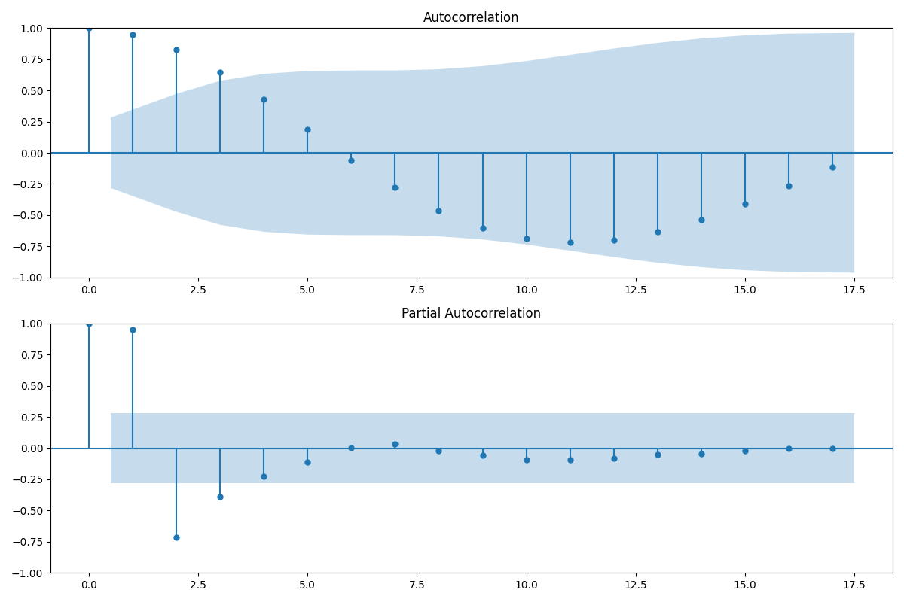

# IoT HVAC Time Series Analysis

This repository contains Python scripts and data files for analyzing HVAC (Heating, Ventilation, and Air Conditioning) systems using time series analysis and IoT (Internet of Things) device simulation. The key components include:

- Time series analysis scripts (arima.py, sarima.py) for forecasting HVAC load using ARIMA and SARIMA models.
- Data generation script (generate_hvac_data_for_timeseries.py) to create synthetic HVAC data.
- Advanced HVAC analysis script (advanced_hvac_analysis.py) for in-depth data exploration and visualization.
- IoT device simulation script (iot_device_simulation.py) to mimic sensor data collection from multiple devices.
- Various CSV files containing HVAC-related data for analysis.

# ARIMA MODEL OUTPUT ANALYSIS

### Original HVAC Load Time Series

This graph shows the historical HVAC load data over time. 
You can see the daily patterns, where the load increases during certain times of the day, possibly due to higher usage.

#

### Autocorrelation and Partial Autocorrelation

The Autocorrelation Function (ACF) graph shows how the current value of the HVAC load is correlated with its past values at different lags. 
Peaks in the ACF plot indicate significant correlations at those lags.

The Partial Autocorrelation Function (PACF) graph shows the correlation between the HVAC load and its lagged values, controlling for the values of the time series at all shorter lags. 
This helps in identifying the direct effect of a lagged value.

#

### Seasonal Decomposition

This set of graphs decomposes the HVAC load time series into three components: trend, seasonal, and residual.

- **Trend**: Shows the overall direction in which the data is moving.
- **Seasonal**: Captures the repeating patterns within each day.
- **Residual**: Represents the remaining variability after removing the trend and seasonal components.

#

### HVAC Load: Historical Data and Forecast

This graph shows the historical HVAC load data along with the forecasted values. 
The red line represents the forecast, and the shaded pink area represents the confidence intervals, indicating the uncertainty around the forecast.

#

### Residuals and Density

The Residuals graph shows the difference between the actual values and the fitted values from the ARIMA model over time. 
The Density plot (KDE plot) shows the distribution of the residuals, which helps in checking if the residuals are normally distributed.

#

### Model Diagnostics

This set of graphs provides diagnostic plots for the ARIMA model:

- **Standardized residuals**: Helps in identifying outliers.
- **Histogram plus estimated density**: Shows the distribution of residuals.
- **Normal Q-Q plot**: Compares the distribution of residuals with a normal distribution.
- **Correlogram**: Displays the autocorrelation of residuals, helping to check if the residuals are white noise.

# SARIMA MODEL OUTPUT ANALYSIS

### Energy Consumption Over Time:
This line plot shows the daily energy consumption from January 1, 2023, to April 1, 2023. 
It highlights fluctuations in consumption, indicating varying energy use patterns over time.

#

### Seasonal Decomposition of Energy Consumption:
- The top panel displays the observed energy consumption over time.
- The second panel illustrates the underlying trend, revealing long-term movement in the data.
- The third panel shows the seasonal component, capturing regular patterns within the data.	
- The bottom panel presents the residuals, indicating the irregular, random noise after removing the trend and seasonal components.

#

### Autocorrelation and Partial Autocorrelation:
- The autocorrelation plot (top) shows the correlation of the time series with its past values, indicating significant lags where correlation exists.
- Partial autocorrelation plot (bottom) depicts the correlation of the time series with its past values, controlling for the values at shorter lags, helping to identify the order of AR terms.

#

###	SARIMA Forecast:
- (My Favorite!) This plot compares the actual energy consumption (blue) with the forecasted values (orange) using our Seasonal ARIMA model. 
- The shaded area represents the confidence interval, indicating the uncertainty of the forecast.

#

### Correlation Heatmap:
- The heatmap visualizes the correlation between energy consumption, temperature, and humidity. 
- High correlation values are indicated in red, showing the strength and direction of relationships among these variables.

#

### Energy Consumption by Hour:
- The box plot shows the distribution of energy consumption by hour of the day. 
- Each box represents the interquartile range, with whiskers indicating variability outside the upper and lower quartiles.

#

### Energy Consumption by Day of Week:
This box plot displays the distribution of energy consumption by day of the week, highlighting variations and identifying days with higher or lower energy use patterns.

#

### Temperature vs. Energy Consumption:
The scatter plot illustrates the relationship between temperature and energy consumption. 
The upward trend suggests a positive correlation, where higher temperatures tend to coincide with increased energy use.

#

### Rolling Statistics:
(Also my favorite!) This plot shows the original energy consumption data along with rolling mean (orange) and rolling standard deviation (green). 
It helps visualize changes in mean and variability over time, providing insights into data stability.
